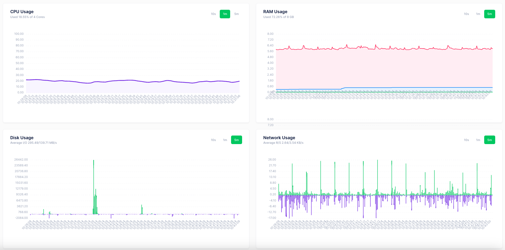

# Netdata Laravel

The free Laravel package to help you integrate with Netdata to analyze server performance information

## Use Cases

- Crawl and parse result from Netdata
- Easy to understand and draw charts
- Example crawler command

## Features

- Dynamic Netdata credentials from config/netdata.php
- Easy to get data with a simple line code

## Requirements

- **PHP**: 8.1 or higher
- **Laravel** 9.0 or higher

## Quick Start

If you prefer to install this package into your own Laravel application, please follow the installation steps below

## Installation

#### Step 1. Install a Laravel project if you don't have one already

https://laravel.com/docs/installation

#### Step 2. Install Netdata if your server does not have it

https://learn.netdata.cloud/docs/netdata-agent/installation

#### Step 3. Require the current package using composer:

```bash
composer require funnydevjsc/netdata-laravel-integrate
```

#### Step 4. Publish the controller file and config file

```bash
php artisan vendor:publish --provider="FunnyDev\Netdata\NetdataServiceProvider" --tag="netdata"
```

If publishing files fails, please create corresponding files at the path `config/netdata.php` and `app\Console\Commands\NetdataCommand.php` from this package.

#### Step 5. Update the various config settings in the published config file:

- After publishing the package assets a configuration file will be located at <code>config/netdata.php</code>.
- Please read the document of Netdata document to get those values to fill into the config file if you are using manual installation and not on any server panel. 
- If you are using a panel like Direct Admin then you could read about the document of Direct Admin to find out. In our case, it was:

```dotenv
NETDATA_SERVER="http://directadmin.domain.ltd:2222/CMD_NETDATA_SOCK"
NETDATA_SCOPE_NODE="52f2daca-33fa-421d-ad90-ce9955f760fa"
NETDATA_USERNAME="username"
NETDATA_PASSWORD="password"
```

#### Step 7. Save data to Database and Draw charts:

You can use or optimize <code>app/Console/Commands/NetdataCommand.php</code> to retrieve data and store the collected data into the Database for convenience in research, evaluation and drawing charts. Drawing charts is possible through Javascript libraries. Example collected data like this (this data bellow is not real and just for demo only):



<!--- ## Usage --->

## Testing

```bash
php artisan netdata:crawl
```

## Feedback

Respect us in the [Laravel Việt Nam](https://www.facebook.com/groups/167363136987053)

## Contributing

Please see [CONTRIBUTING](CONTRIBUTING.md) for details.

### Security

If you discover any security related issues, please email contact@funnydev.vn or use the issue tracker.

## Credits

- [Funny Dev., Jsc](https://github.com/funnydevjsc)
- [All Contributors](../../contributors)

## License

The MIT License (MIT). Please see [License File](LICENSE.md) for more information.
